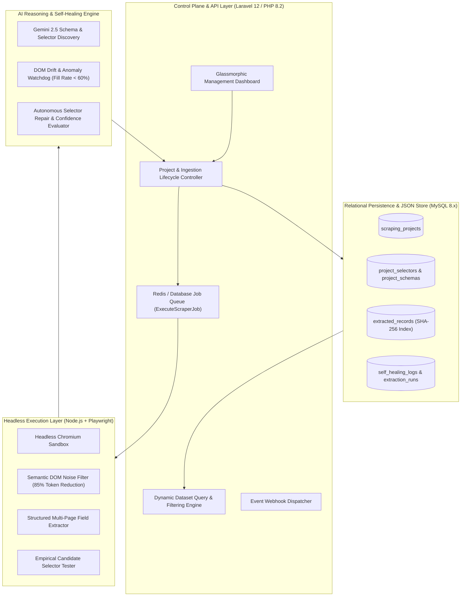
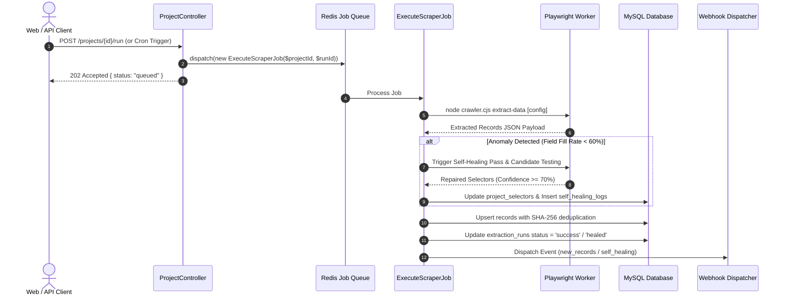

<div align="center">

# 🌐 OmniScrape AI (WebMind)

### Autonomous Web Data Infrastructure & Self-Healing REST API Engine

**An enterprise-grade autonomous data platform that transforms any public website into structured, continuously synchronized, self-healing, API-accessible datasets using natural language.**

[](https://laravel.com)
[](https://php.net)
[](https://playwright.dev)
[](https://ai.google.dev)
[](https://github.com/ShakhawatSakib9)
[](LICENSE)

</div>

---

## 📌 Executive Summary & Problem Space

Traditional web scraping architectures suffer from two structural vulnerabilities that make them expensive and fragile in production:

1. **High Setup Overhead:** Writing, maintaining, and debugging brittle CSS/XPath selectors manually for every distinct web layout.
2. **Silent Pipeline Failure (DOM Drift):** Website redesigns, A/B tests, or minor CSS class renames immediately invalidate selectors. Conventional scrapers break silently, outputting null data or throwing uncaught crawler exceptions until an engineer intervenes.

**OmniScrape AI** eliminates both bottlenecks. It couples **Headless Browser Automation (Playwright)** with **LLM Semantic Reasoning (Gemini 2.5)** and an **Autonomous Self-Healing Watchdog Engine** that automatically detects, validates, and repairs selector failures without requiring routine manual maintenance.

```
⚡ Platform Capabilities:
• 🧠 Natural Language to Schema Inference: Plain English Prompt + URL → Structured Schema & Selectors
• 🕷️ Headless Browser Worker: Handles dynamic React/Vue SPAs, lazy loading, and infinite scrolling
• 🛡️ The Self-Healing Moat: Detects DOM drift, discovers replacements, validates with empirical scoring
• ⚡ Instant Dynamic REST API: Auto-provisions filtered, paginated endpoints (/api/v1/datasets/{slug})
• 🔐 Enterprise Security: SSRF protection, private IP blocking, sandboxed browser execution
• ⚙️ Asynchronous Queue Engine: Redis-backed background workers with 3-tier exponential backoff
```

---

## 🏛️ System Architecture



---

## 🧠 AI Schema Inference: Concrete Output Contract

When an operator provides a target URL and a plain-English prompt (*"Extract gaming laptop names, current prices in USD, discount percentages, and availability"*), the system renders the page via Playwright, strips non-semantic elements (reducing token overhead by **~85%**), and prompts Gemini 2.5 with a strict JSON generation contract.

### Structured LLM Output Contract Example:
```json
{
  "name": "E-Commerce Gaming Laptops Dataset",
  "container_selector": ".product-card, article.product-item",
  "fields": [
    {
      "field_name": "laptop_title",
      "field_label": "Laptop Model & Title",
      "field_type": "string",
      "is_required": true,
      "description": "Full brand and model title of the laptop",
      "primary_selector": "h3.product-title a",
      "fallback_selectors": [".product-header a", "a[data-qa='product-name']"],
      "attribute_target": "text",
      "confidence_score": 0.98
    },
    {
      "field_name": "price_usd",
      "field_label": "Price (USD)",
      "field_type": "price",
      "is_required": true,
      "description": "Current selling price in USD",
      "primary_selector": ".price-current .amount",
      "fallback_selectors": ["span.price-sales", "[itemprop='price']"],
      "attribute_target": "text",
      "confidence_score": 0.96
    },
    {
      "field_name": "availability",
      "field_label": "Stock Status",
      "field_type": "string",
      "is_required": false,
      "description": "Current inventory availability state",
      "primary_selector": ".inventory-badge",
      "fallback_selectors": [".stock-status span"],
      "attribute_target": "text",
      "confidence_score": 0.91
    }
  ],
  "pagination": {
    "type": "next_button",
    "selector": "li.pagination-next a"
  }
}
```

---

## 🛡️ The Self-Healing Engine & Confidence Scoring Methodology

When a target website updates its DOM markup, traditional scrapers fail silently. OmniScrape AI monitors extraction telemetry in real-time.

```
┌───────────────────────────────────────────────────────────────────────────────┐
│                          Self-Healing Lifecycle Flow                          │
├───────────────────────────────────────────────────────────────────────────────┤
│ 1. Telemetry Ingestion: Worker executes extraction with registered selectors  │
│ 2. Anomaly Detection: Required field fill rate drops below threshold (< 60%)  │
│ 3. Fresh DOM Snapshot: Headless worker captures latest rendered HTML tree      │
│ 4. Semantic Diagnosis: LLM analyzes layout changes & suggests 3-5 candidates  │
│ 5. Empirical Verification: Playwright test-evaluates candidates on live DOM    │
│ 6. Confidence Scoring: Calculates Composite Score (Weights: 0.35/0.30/0.20/0.15)│
│ 7. Hot-Swap & Audit: If Score >= 70%, updates DB selector & logs full audit   │
│ 8. Ingestion Recovery: Re-runs extraction after successful selector repair    │
└───────────────────────────────────────────────────────────────────────────────┘
```

### 📐 Confidence Scoring Formula:

Candidate selectors generated during self-healing are evaluated using a weighted multi-variable scoring model:

$$\text{Confidence Score} = (M_{\text{structural}} \times 0.35) + (C_{\text{coverage}} \times 0.30) + (V_{\text{validity}} \times 0.20) + (S_{\text{specificity}} \times 0.15)$$

Where:
- **$M_{\text{structural}}$ (35%):** Structural DOM match density — ensures candidate selector maps to the expected container depth.
- **$C_{\text{coverage}}$ (30%):** Percentage of sampled target items for which the candidate selector returns a non-null value (targeting $\ge 90\%$ non-null coverage across sampled target items).
- **$V_{\text{validity}}$ (20%):** Data type & regex validation score (e.g. numeric integrity for prices, URL formatting for links).
- **$S_{\text{specificity}}$ (15%):** Selector specificity index — penalizes overly generic selectors (like bare `div` or `span`) to prevent false-positive drift.

---

## ⚙️ Asynchronous Queue & Worker Architecture

To guarantee high scalability without blocking HTTP request threads, crawler executions are decoupled into asynchronous background jobs.



### 🔄 Queue Failure & Retry Policy:
- **Retries:** 3 attempts with exponential backoff (`$backoff = [10, 30, 90]` seconds).
- **Timeout:** Hard 120-second timeout per queue job.
- **Dead-Letter Handling:** Failed attempts trigger `failed(\Throwable $e)` hook, recording detailed stack traces in `extraction_runs.error_log` and alerting the dashboard.

---

## 🔐 Security & Abuse Protection

| Security Vector | Mitigation Strategy | Implementation Details |
|---|---|---|
| **SSRF Protection** | Multi-Layer Network Filtering | Enforces HTTP/HTTPS-only schemes, loopback blocking (`127.0.0.0/8`, `::1`), RFC 1918 private subnets, link-local ranges (`169.254.0.0/16`, `fe80::/10`), DNS pre-resolution validation, and redirect re-validation. |
| **Browser Context Isolation** | Ephemeral Contexts | Each extraction executes in an isolated, stateless Playwright browser context with ephemeral session and cache boundaries. |
| **Resource Exhaustion** | Crawl Depth & Timeout Caps | Hard limit of 30 seconds per navigation, maximum 20 pages per batch crawl, and 90-second process termination. |
| **Token Cost Guard** | Semantic DOM Minifier | Strips scripts, SVGs, style tags, and tracking attributes before LLM ingestion, capping payload budgets at 35KB. |
| **API Authentication** | Rate Limiting & Hashing | Public REST endpoints are guarded by `throttle:60,1` (60 req/min) and custom `api_keys` token validation. |
| **Data Integrity** | SHA-256 Deduplication | Unique hash index `UNIQUE KEY (project_id, record_hash)` prevents record duplication across repeated crawler passes. |

---

## ⚙️ Reliability & Failure Handling Matrix

| Failure Scenario | Automatic Recovery Mechanism | Final State |
|---|---|---|
| **Transient Network / DNS Glitch** | 3-stage exponential backoff retry ($10\text{s} \rightarrow 30\text{s} \rightarrow 90\text{s}$) in queue worker. | Recovered after retry |
| **Target Website CSS Renamed** | Self-Healing Watchdog re-analyzes DOM, discovers replacement selectors, and hot-swaps DB. | `status = 'healed'` |
| **Anti-Bot / Access Restriction** | Detects blocked or challenge responses and records the run as restricted for administrative review. | `status = 'restricted'` |
| **Repeated Unchanged Data** | SHA-256 fingerprint matching updates `last_seen_at` without duplicate record insertions. | Idempotent Sync |
| **Hard Node/Process Crash** | Symfony Process wrapper catches stderr, terminates orphaned Chromium PIDs, logs stack trace. | `status = 'failed'` |

---

## 🗄️ Relational Database Schema

```
scraping_projects
├── id, uuid, name, slug, target_url, prompt
├── frequency_cron, status: [draft, active, paused, healing, failed]
├── pagination_type, container_selector, max_pages, last_run_at
└── created_at, updated_at

project_schemas
├── id, project_id, field_name, field_label, field_type, is_required
└── created_at, updated_at

project_selectors
├── id, project_id, schema_id, field_name, primary_selector
├── fallback_selectors, attribute_target, confidence_score, status
└── last_successful_extraction_at, created_at, updated_at

extracted_records
├── id, project_id, record_hash (SHA-256 index for deduplication)
├── data_json (Normalized structured JSON payload)
├── first_seen_at, last_seen_at, status
└── created_at, updated_at

extraction_runs
├── id, project_id, status: [running, success, healed, failed]
├── records_extracted, records_new, records_updated, execution_time_ms
└── started_at, completed_at, error_log

self_healing_logs
├── id, project_id, run_id, field_name, broken_selector, repaired_selector
├── old_confidence, new_confidence, sample_extracted_value, reasoning_log
└── created_at
```

---

## ⚡ Instant Dynamic REST API Specification

Every scraping project automatically exposes a query-optimized REST endpoint:

### Base Endpoint:
`GET /api/v1/datasets/{slug}`

### Query Parameters & Filtering Capabilities:
- **Text Search:** `?search=macbook` (Searches full-text across extracted JSON attributes)
- **Exact Field Match:** `?filter[author]=Albert Einstein`
- **Numeric Comparison:** `?filter[price_min]=50&filter[price_max]=200`
- **Multi-Field Sorting:** `?sort=-price` (descending) or `?sort=id` (ascending)
- **Pagination:** `?page=1&per_page=20` (Max: 100 per page)
- **Live CSV Export:** `GET /api/v1/datasets/{slug}/export?format=csv` (Streams live CSV file download)

### Sample API Response:
```json
{
  "success": true,
  "dataset": {
    "name": "Famous Quotes & Authors Dataset",
    "slug": "famous-quotes-authors-dataset",
    "target_url": "https://quotes.toscrape.com/",
    "total_records": 10,
    "last_synced_at": "2026-09-03T10:00:00.000Z"
  },
  "pagination": {
    "current_page": 1,
    "per_page": 20,
    "total_pages": 1,
    "has_more": false
  },
  "data": [
    {
      "_id": 1,
      "_record_hash": "7f83b1657ff1fc53b92dc18148a1d65dfc2d4b1fa3d677284addd200126d9069",
      "_first_seen_at": "2026-09-03T10:00:00.000Z",
      "_last_seen_at": "2026-09-03T10:00:00.000Z",
      "quote_text": "“The world as we have created it is a process of our thinking...”",
      "author": "Albert Einstein",
      "author_link": "https://quotes.toscrape.com/author/Albert-Einstein"
    }
  ]
}
```

---

## 🧪 Verification & Empirical Test Results

```bash
# 1. End-to-End Extraction & REST API Pipeline Test:
✅ Extracted Records: 10
✅ Database Persistence (SHA-256 Deduplication): PASS
✅ Dynamic REST API GET: PASS (Status 200, Filter & Pagination OK)

# 2. Autonomous Self-Healing Simulation Test (Injected Broken Selector):
⚠️ Injected Fault: quote_text selector modified to '.broken-old-quote-text'
🚨 Anomaly Watchdog: Fill rate dropped to 0.0% -> Activated Self-Healing
🧠 AI Diagnosis: Discovered candidate replacement selector '.text'
🧪 Empirical Validation: Playwright match count 5/5 -> Confidence 100%
✅ DB Hot-Swap: Project selector status updated to 'repaired'
📝 Audit Log Recorded: Broken (.broken-old-quote-text) -> Repaired (.text)

# 3. Multi-Dataset Live Ingestion (Books To Scrape E-Commerce):
✅ 20 E-commerce books extracted in 6.9s with price normalization
✅ Dynamic API query ?filter[price_min]=50 returned 8 filtered records
```

---

## 🚀 Quickstart & Installation

```bash
# 1. Clone repository
git clone https://github.com/ShakhawatSakib9/OmniScrape-AI-WebMind-.git
cd OmniScrape-AI-WebMind-

# 2. Install PHP & Node dependencies
composer install
npm install
npx playwright install chromium

# 3. Environment setup
cp .env.example .env
php artisan key:generate

# Set your database & Gemini API key in .env:
# DB_DATABASE=omniscrape_db
# GEMINI_API_KEY=your_gemini_api_key

# 4. Run database migrations
php artisan migrate

# 5. Start Queue Worker & Local Server
php artisan queue:work
php artisan serve
```

---

## 👨‍💻 Author & Lead Architect

**Md. Shakhawat Hossain (Sakib)**  
*Software Engineer | Backend & Full-Stack Engineer | Laravel & SaaS Specialist*  
- 🌐 **Portfolio:** [shakhawatsakib9.github.io/portfolio](https://shakhawatsakib9.github.io/portfolio/)  
- 💼 **LinkedIn:** [linkedin.com/in/md-shakhawat-hossain-0a8ba0352](https://www.linkedin.com/in/md-shakhawat-hossain-0a8ba0352/)  
- 🐙 **GitHub:** [@ShakhawatSakib9](https://github.com/ShakhawatSakib9)  

---

<div align="center">
  <i>"Simplicity is prerequisite for reliability. Autonomous data pipelines that adapt as the web evolves."</i>
</div>