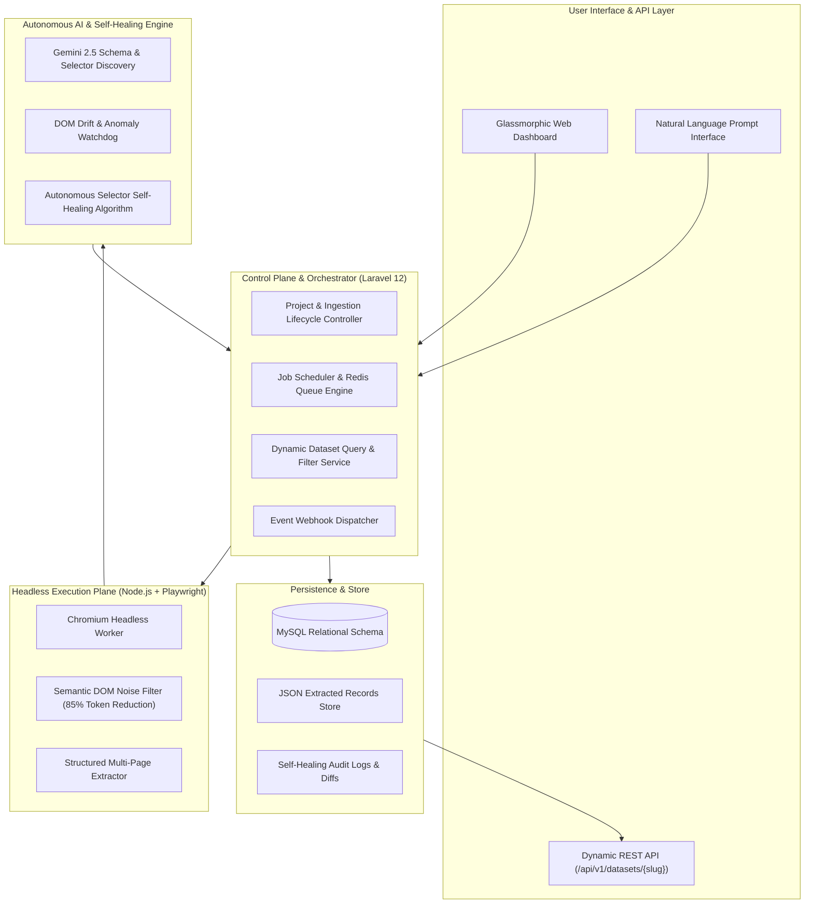

<div align="center">

# 🌐 OmniScrape AI — Autonomous Web Data & Self-Healing REST API Platform

**Transform Any Public Website into Structured, Real-Time, Self-Healing REST APIs using Natural Language**

[](https://laravel.com)
[](https://php.net)
[](https://playwright.dev)
[](https://ai.google.dev)
[](https://github.com/ShakhawatSakib9)
[](LICENSE)

</div>

---

## 📌 Executive Overview

**OmniScrape AI** is an enterprise-grade autonomous data infrastructure platform designed to bridge the gap between unstructured web content and production-ready applications. 

Traditional web scrapers suffer from two fatal vulnerabilities:
1. **High Setup Overhead:** Writing, maintaining, and updating complex CSS/XPath selectors manually.
2. **Fragile Maintenance (DOM Drift):** Any minor website redesign breaks brittle selectors, leading to silent data pipelines failure.

OmniScrape AI eliminates both bottlenecks by combining **Headless Browser Automation (Playwright)**, **LLM Semantic Reasoning (Gemini 2.5)**, and an **Autonomous Self-Healing Watchdog Engine** that automatically detects broken selectors, re-analyzes DOM structures, evaluates candidate selectors with confidence scoring, and repairs ingestion pipelines with zero human intervention.

---

## 🏛️ System Architecture



---

## ⚡ Core Engineering Highlights

### 1. 🧠 Natural Language to Schema Inference
Users describe their data requirements in plain English (e.g., *"Extract laptop titles, current prices in USD, discount percentages, and star ratings"*).
- The platform launches a headless browser, renders dynamic JavaScript SPAs, and captures the live DOM.
- **Semantic DOM Minifier:** Strips SVGs, tracking scripts, style blocks, and comments to reduce LLM token consumption by **~85%**.
- Gemini 2.5 analyzes the minified DOM and autonomously outputs the target container selector, field data types, primary CSS selectors, and fallback alternatives.

### 2. 🛡️ The Killer Moat: Autonomous Self-Healing Engine
```
┌─────────────────────────────────────────────────────────────────────────┐
│                      Self-Healing Workflow Cycle                        │
├─────────────────────────────────────────────────────────────────────────┤
│ 1. Ingestion Execution: Run extraction with registered primary selector │
│ 2. Anomaly Detection: Required field fill rate drops below 60%          │
│ 3. Fresh DOM Snapshot: Headless worker captures latest page structure   │
│ 4. Semantic Diagnosis: LLM analyzes layout changes & discovers candidates│
│ 5. Empirical Verification: Playwright test-runs top candidate selectors │
│ 6. Confidence Scoring: Selects best candidate with Confidence >= 70%    │
│ 7. Hot-Swap & Audit: Updates DB selector, logs diff, resumes ingestion   │
└─────────────────────────────────────────────────────────────────────────┘
```

### 3. 🚀 Instant Dynamic REST API Generator
Every configured scraper automatically provisions a secure, production-grade REST endpoint:
- **Base Endpoint:** `GET /api/v1/datasets/{slug}`
- **Search:** `?search=macbook`
- **Field Filters:** `?filter[brand]=Apple&filter[price_min]=999`
- **Sorting:** `?sort=-price` (descending) or `?sort=created_at`
- **Pagination:** `?page=1&per_page=50`
- **Export Options:** Live CSV streaming (`/export?format=csv`) and JSON dumps.

---

## 🗄️ Relational Database Schema

```
scraping_projects
├── id, uuid, name, slug, target_url, prompt
├── frequency_cron, status: [draft, active, paused, healing, failed]
├── pagination_type, container_selector, max_pages, last_run_at
└── created_at, updated_at

project_schemas
├── id, project_id, field_name, field_label, field_type, is_required
└── created_at, updated_at

project_selectors
├── id, project_id, schema_id, field_name, primary_selector
├── fallback_selectors, attribute_target, confidence_score, status
└── last_successful_extraction_at, created_at, updated_at

extracted_records
├── id, project_id, record_hash (SHA-256 deduplication index)
├── data_json (Normalized structured payload)
├── first_seen_at, last_seen_at, status
└── created_at, updated_at

self_healing_logs
├── id, project_id, run_id, field_name, broken_selector, repaired_selector
├── old_confidence, new_confidence, sample_extracted_value, reasoning_log
└── created_at
```

---

## 💻 Tech Stack & Dependencies

- **Backend Framework:** Laravel 12.x (PHP 8.2+)
- **Database:** MySQL 8.x / MariaDB
- **Browser Automation:** Node.js, Playwright (Chromium), Cheerio
- **AI & Reasoning:** Google Gemini 2.5 Flash API (Structured JSON Schema)
- **Frontend Dashboard:** Vanilla Blade, Glassmorphism TailwindCSS, FontAwesome 6, Google Fonts (Outfit & Fira Code)

---

## 🚀 Quickstart & Local Setup

### 1. Prerequisites
- PHP 8.2+ with `pdo_mysql`, `curl`, `mbstring` extensions
- Composer 2.x
- Node.js 18+ and NPM
- MySQL 8.x

### 2. Installation
```bash
# Clone the repository
git clone https://github.com/ShakhawatSakib9/OmniScrape-AI.git
cd OmniScrape-AI

# Install PHP dependencies
composer install

# Install Node.js dependencies & Playwright Chromium
npm install
npx playwright install chromium

# Environment Configuration
cp .env.example .env
php artisan key:generate

# Set your database and Gemini API key in .env:
# DB_DATABASE=omniscrape_db
# GEMINI_API_KEY=your_gemini_api_key_here

# Run Migrations
php artisan migrate

# Start Local Development Server
php artisan serve
```

---

## 👨‍💻 Author & Lead Architect

**Md. Shakhawat Hossain (Sakib)**  
*Software Engineer | Backend & Full-Stack Architect*  
- 🌐 **Portfolio:** [shakhawatsakib9.github.io/portfolio](https://shakhawatsakib9.github.io/portfolio/)  
- 💼 **LinkedIn:** [linkedin.com/in/md-shakhawat-hossain-0a8ba0352](https://www.linkedin.com/in/md-shakhawat-hossain-0a8ba0352/)  
- 🐙 **GitHub:** [@ShakhawatSakib9](https://github.com/ShakhawatSakib9)  

---

<div align="center">
  <i>"Autonomous data pipelines that adapt as the web evolves."</i>
</div>